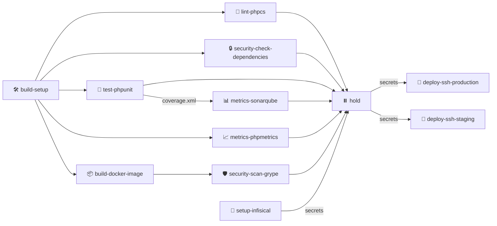
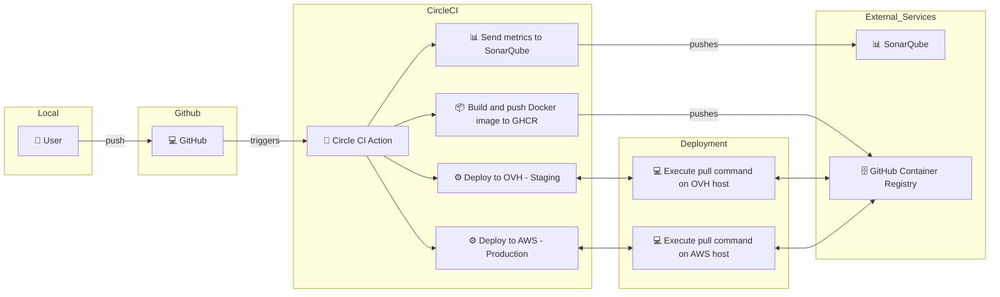

# PHP Security CI Example

[](https://sonarqube.devops-tools.apoorva64.com/dashboard?id=php-sec-ci)
[](https://sonarqube.devops-tools.apoorva64.com/dashboard?id=php-sec-ci)
[](https://sonarqube.devops-tools.apoorva64.com/dashboard?id=php-sec-ci)
[](https://sonarqube.devops-tools.apoorva64.com/dashboard?id=php-sec-ci)
[](https://sonarqube.devops-tools.apoorva64.com/dashboard?id=php-sec-ci)

This project demonstrates a complete CI/CD pipeline for a PHP application with robust security measures and best practices.

## 🚀 Features

- Dynamic image generation with custom text and colors
- Environment variable configuration
- Comprehensive CI/CD pipeline with CircleCI
- Docker containerization
- Automated security checks and code quality analysis
- Multiple deployment environments (staging and production)

## 🛠️ Technical Stack

- PHP 8.2
- Apache Web Server
- SQLite Database
- Docker
- CircleCI
- SonarQube
- PHPUnit
- PHP_CodeSniffer
- PHPMetrics

## 🏗️ Project Structure

```
.
├── docker/
│   └── Dockerfile
├── public/
│   ├── index.php
│   └── font/
├── src/
│   └── ImageCreator.php
├── .circleci/
│   └── config.yml
├── composer.json
└── .env.example
```

## 📋 Prerequisites

- PHP 8.2+
- Composer
- Docker (optional)
- Git

## 🚀 Getting Started

1. Clone the repository:
```bash
git clone [repository-url]
```

2. Install dependencies:
```bash
composer install
```

3. Copy the environment file and configure it:
```bash
cp .env.example .env
```

4. Run the application locally:
```bash
php -S localhost:8000 -t public
```

## 🐳 Docker Usage

Build the image:
```bash
docker build -f docker/Dockerfile -t php-sec-ci .
```

Run the container:
```bash
docker run -p 8080:80 php-sec-ci
```

## 🔄 CI/CD Pipeline

The project includes a comprehensive CircleCI pipeline that:

- Runs code quality checks
- Performs security analysis
- Executes unit tests
- Generates metrics reports
- Builds and pushes Docker images
- Deploys to staging and production environments

### Pipeline Steps



### Pipeline Integration



## 📊 Quality Metrics

- SonarQube analysis
- PHPMetrics reports
- Code coverage reports
- PHP_CodeSniffer checks

## 🔒 Security

- Automated dependency security checks
- Code quality analysis
- Secure deployment process
- Environment variable management

## 📄 License

This project is proprietary and all rights are reserved.

## 👥 Contributing

Please refer to the project's style and contribution guidelines for submitting patches and additions. In general, follow the "fork-and-pull" Git workflow.

## 📞 Support

For support, please open an issue in the repository's issue tracker.
