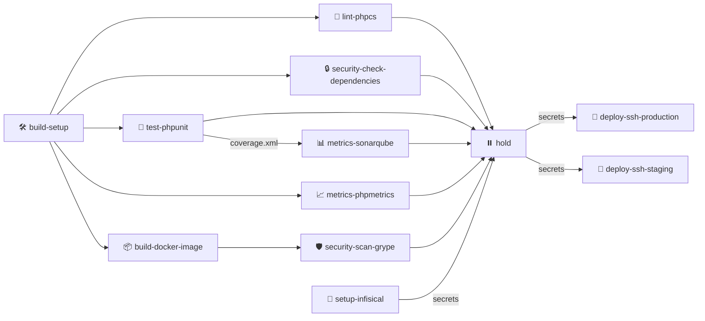
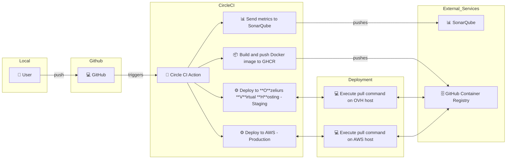

# CircleCI Pipeline Documentation

## Pipeline Overview

This CircleCI pipeline implements a comprehensive CI/CD workflow for PHP applications with security checks, testing, and deployment capabilities.

## Deployment Flow

## Pipeline Jobs Description

1. **build-setup** 🛠️
   - Installs PHP dependencies
   - Caches vendor directory
   - Sets up the initial workspace

2. **build-docker-image** 📦
   - Builds Docker image
   - Pushes to GitHub Container Registry
   - Tags with branch name and commit hash

3. **Quality & Security Checks**
   - **lint-phpcs** 🧹: PHP CodeSniffer checks
   - **security-check-dependencies** 🔒: Security vulnerability scanning
   - **test-phpunit** 🧪: Unit testing with coverage
   - **metrics-sonarqube** 📊: Code quality analysis
   - **metrics-phpmetrics** 📈: PHP metrics generation
   - **security-scan-grype** 🛡️: Container security scanning

4. **Deployment Process**
   - **setup-infisical** 🔑: Manages environment secrets
   - **hold** ⏸️: Manual approval gate
   - **deploy-ssh-production** 🚀: Production deployment
   - **deploy-ssh-staging** 🚀: Staging deployment

## Environment and Branches

- Production deployments: `main` and `master` branches
- Staging deployments: `release/*` branches
- Automated testing: All branches
