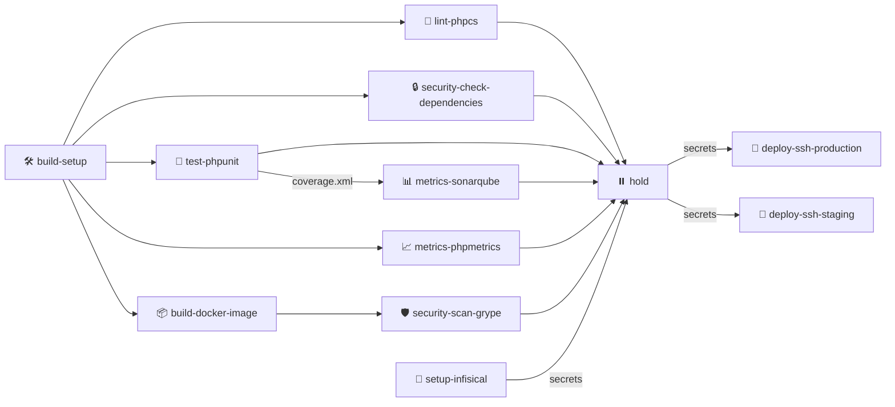
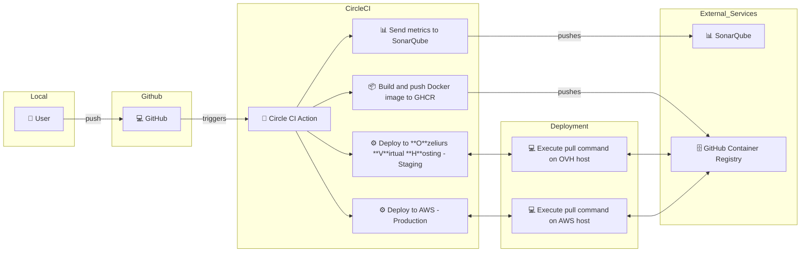

# Full Report

## Pipeline Overview

This CircleCI pipeline implements a comprehensive CI/CD workflow for PHP applications with security checks, testing, and deployment capabilities.



## Deployment Flow



## Pipeline Jobs Description

1. **build-setup** 🛠️
   - Installs PHP dependencies
   - Caches vendor directory
   - Sets up the initial workspace

2. **build-docker-image** 📦
   - Builds Docker image
   - Pushes to GitHub Container Registry
   - Tags with branch name and commit hash

3. **Quality & Security Checks**
   - **lint-phpcs** 🧹: PHP CodeSniffer checks
   - **security-check-dependencies** 🔒: Security vulnerability scanning
   - **test-phpunit** 🧪: Unit testing with coverage
   - **metrics-sonarqube** 📊: Code quality analysis
   - **metrics-phpmetrics** 📈: PHP metrics generation
   - **security-scan-grype** 🛡️: Container security scanning

4. **Deployment Process**
   - **setup-infisical** 🔑: Manages environment secrets
   - **hold** ⏸️: Manual approval gate
   - **deploy-ssh-production** 🚀: Production deployment
   - **deploy-ssh-staging** 🚀: Staging deployment

## Environment and Branches

- Production deployments: `main` branch
- Staging deployments: `dev` branch
- Automated testing: All branches

## 🐳 Docker Image Pruning

A SBOM and Vulnerability scan of the docker image shows that is contains too much packages and vulnerabilities.

Here is the `syft` output:

```
[16:34:54] ozeliurs@MacBook-Air-de-Maxime-2:~ ()
% syft ghcr.io/startupnationlabs/php-sec-ci:main
 ✔ Pulled image
 ✔ Loaded image
 ✔ Parsed image
 ✔ Cataloged contents
   ├── ✔ Packages                        [331 packages]
   ├── ✔ File digests                    [8,322 files]
   ├── ✔ File metadata                   [8,322 locations]
   └── ✔ Executables                     [1,085 executables]
```

And here is the `grype` output:

```
[17:12:02] ozeliurs@MacBook-Air-de-Maxime-2:~ ()
% grype ghcr.io/startupnationlabs/php-sec-ci:ed920ce
 ✔ Vulnerability DB                [updated]
 ✔ Loaded image
 ✔ Parsed image
 ✔ Cataloged contents
   ├── ✔ Packages                        [214 packages]
   ├── ✔ File digests                    [8,226 files]
   ├── ✔ File metadata                   [8,226 locations]
   └── ✔ Executables                     [1,048 executables]
 ✔ Scanned for vulnerabilities     [248 vulnerability matches]
   ├── by severity: 3 critical, 80 high, 223 medium, 8 low, 263 negligible (166 unknown)
   └── by status:   0 fixed, 743 not-fixed, 495 ignored
```

### 📦 Trimming the Docker Image

By analyzing the `syft` output, we saw that `infisical`, `xdebug` and `sqlite3` were installed but not used in the project.

We removed them from the `Dockerfile` and rebuilt the image.

### 🐳 Docker Image Pruning

We saw that the base image `php:8.2-apache` contains a lot of packages and one critical vulnerability.

```
[17:17:02] ozeliurs@MacBook-Air-de-Maxime-2:~ ()
% grype php:8.2-apache
 ✔ Vulnerability DB                [no update available]
 ✔ Pulled image
 ✔ Loaded image
 ✔ Parsed image
 ✔ Cataloged contents
   ├── ✔ Packages                        [189 packages]
   ├── ✔ File digests                    [8,145 files]
   ├── ✔ File metadata                   [8,145 locations]
   └── ✔ Executables                     [1,039 executables]
 ✔ Scanned for vulnerabilities     [244 vulnerability matches]
   ├── by severity: 2 critical, 80 high, 223 medium, 8 low, 260 negligible (166 unknown)
   └── by status:   0 fixed, 739 not-fixed, 495 ignored
```

We decided to switch to `php:8.2-alpine` which is a lighter image and contains no vulnerabilities.

```
[17:22:54] ozeliurs@MacBook-Air-de-Maxime-2:~ ()
% grype php:8.2-alpine
 ✔ Vulnerability DB                [no update available]
 ✔ Pulled image
 ✔ Loaded image
 ✔ Parsed image
 ✔ Cataloged contents
   ├── ✔ Packages                        [39 packages]
   ├── ✔ File digests                    [302 files]
   ├── ✔ File metadata                   [302 locations]
   └── ✔ Executables                     [53 executables]
 ✔ Scanned for vulnerabilities     [0 vulnerability matches]
   ├── by severity: 0 critical, 0 high, 0 medium, 0 low, 0 negligible
   └── by status:   0 fixed, 0 not-fixed, 0 ignored
No vulnerabilities found
```

### 🚀 Conclusion

By trimming the Docker image and switching to a lighter base image, we were able to reduce the number of packages and vulnerabilities.

The SBOM now reports significantly less packages.
```
[17:37:21] ozeliurs@MacBook-Air-de-Maxime-2:~ ()
% syft ghcr.io/startupnationlabs/php-sec-ci:cc65665
 ✔ Loaded image
 ✔ Parsed image
 ✔ Cataloged contents
   ├── ✔ Packages                        [65 packages]
   ├── ✔ File digests                    [404 files]
   ├── ✔ File metadata                   [404 locations]
   └── ✔ Executables                     [64 executables]
```

And the Vulnerability scan now reports no vulnerabilities.
```
[17:33:56] ozeliurs@MacBook-Air-de-Maxime-2:~ ()
% grype ghcr.io/startupnationlabs/php-sec-ci:cc65665
 ✔ Vulnerability DB                [no update available]
 ✔ Pulled image
 ✔ Loaded image
 ✔ Parsed image
 ✔ Cataloged contents
   ├── ✔ Packages                        [65 packages]
   ├── ✔ File digests                    [404 files]
   ├── ✔ File metadata                   [404 locations]
   └── ✔ Executables                     [64 executables]
 ✔ Scanned for vulnerabilities     [0 vulnerability matches]
   ├── by severity: 0 critical, 0 high, 0 medium, 0 low, 0 negligible
   └── by status:   0 fixed, 0 not-fixed, 0 ignored
No vulnerabilities found
```
