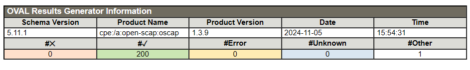

# Full Report

## Pipeline Overview

This CircleCI pipeline implements a comprehensive CI/CD workflow for PHP applications with security checks, testing, and deployment capabilities.

```mermaid
flowchart LR
  A[🛠️ build-setup]
  B[📦 build-docker-image]
  C[🧹 lint-phpcs]
  D[🔒 security-check-dependencies]
  E[🧪 test-phpunit]
  F[📊 metrics-sonarqube]
  G[📈 metrics-phpmetrics]
  H[🛡️ security-scan-grype]
  I[🔑 setup-infisical]
  J[⏸️ hold]
  K[🚀 deploy-ssh-production]
  L[🚀 deploy-ssh-staging]

  A --> B
  A --> C
  A --> D
  A --> E
  A --> G
  E -- coverage.xml --> F
  B --> H
  C --> J
  D --> J
  E --> J
  F --> J
  G --> J
  H --> J
  I -- secrets --> J
  J -- secrets --> K
  J -- secrets --> L
```



## Pipeline Jobs Description

1. **build-setup** 🛠️
   - Installs PHP dependencies
   - Caches vendor directory
   - Sets up the initial workspace

2. **build-docker-image** 📦
   - Builds Docker image
   - Pushes to GitHub Container Registry
   - Tags with branch name and commit hash

3. **Quality & Security Checks**
   - **lint-phpcs** 🧹: PHP CodeSniffer checks
   - **security-check-dependencies** 🔒: Security vulnerability scanning
   - **test-phpunit** 🧪: Unit testing with coverage
   - **metrics-sonarqube** 📊: Code quality analysis
   - **metrics-phpmetrics** 📈: PHP metrics generation
   - **security-scan-grype** 🛡️: Container security scanning

4. **Deployment Process**
   - **setup-infisical** 🔑: Manages environment secrets
   - **hold** ⏸️: Manual approval gate
   - **deploy-ssh-production** 🚀: Production deployment
   - **deploy-ssh-staging** 🚀: Staging deployment

## Environment and Branches

- Production deployments: `main` branch
- Staging deployments: `dev` branch
- Automated testing: All branches

## 🐳 Docker Image Pruning

A SBOM and Vulnerability scan of the docker image shows that is contains too much packages and vulnerabilities.

Here is the `syft` output:

```
[16:34:54] ozeliurs@MacBook-Air-de-Maxime-2:~ ()
% syft ghcr.io/startupnationlabs/php-sec-ci:main
 ✔ Pulled image
 ✔ Loaded image
 ✔ Parsed image
 ✔ Cataloged contents
   ├── ✔ Packages                        [331 packages]
   ├── ✔ File digests                    [8,322 files]
   ├── ✔ File metadata                   [8,322 locations]
   └── ✔ Executables                     [1,085 executables]
```

And here is the `grype` output:

```
[17:12:02] ozeliurs@MacBook-Air-de-Maxime-2:~ ()
% grype ghcr.io/startupnationlabs/php-sec-ci:ed920ce
 ✔ Vulnerability DB                [updated]
 ✔ Loaded image
 ✔ Parsed image
 ✔ Cataloged contents
   ├── ✔ Packages                        [214 packages]
   ├── ✔ File digests                    [8,226 files]
   ├── ✔ File metadata                   [8,226 locations]
   └── ✔ Executables                     [1,048 executables]
 ✔ Scanned for vulnerabilities     [248 vulnerability matches]
   ├── by severity: 3 critical, 80 high, 223 medium, 8 low, 263 negligible (166 unknown)
   └── by status:   0 fixed, 743 not-fixed, 495 ignored
```

### 📦 Trimming the Docker Image

By analyzing the `syft` output, we saw that `infisical`, `xdebug` and `sqlite3` were installed but not used in the project.

We removed them from the `Dockerfile` and rebuilt the image.

### 🐳 Docker Image Pruning

We saw that the base image `php:8.2-apache` contains a lot of packages and one critical vulnerability.

```
[17:17:02] ozeliurs@MacBook-Air-de-Maxime-2:~ ()
% grype php:8.2-apache
 ✔ Vulnerability DB                [no update available]
 ✔ Pulled image
 ✔ Loaded image
 ✔ Parsed image
 ✔ Cataloged contents
   ├── ✔ Packages                        [189 packages]
   ├── ✔ File digests                    [8,145 files]
   ├── ✔ File metadata                   [8,145 locations]
   └── ✔ Executables                     [1,039 executables]
 ✔ Scanned for vulnerabilities     [244 vulnerability matches]
   ├── by severity: 2 critical, 80 high, 223 medium, 8 low, 260 negligible (166 unknown)
   └── by status:   0 fixed, 739 not-fixed, 495 ignored
```

We decided to switch to `php:8.2-alpine` which is a lighter image and contains no vulnerabilities.

```
[17:22:54] ozeliurs@MacBook-Air-de-Maxime-2:~ ()
% grype php:8.2-alpine
 ✔ Vulnerability DB                [no update available]
 ✔ Pulled image
 ✔ Loaded image
 ✔ Parsed image
 ✔ Cataloged contents
   ├── ✔ Packages                        [39 packages]
   ├── ✔ File digests                    [302 files]
   ├── ✔ File metadata                   [302 locations]
   └── ✔ Executables                     [53 executables]
 ✔ Scanned for vulnerabilities     [0 vulnerability matches]
   ├── by severity: 0 critical, 0 high, 0 medium, 0 low, 0 negligible
   └── by status:   0 fixed, 0 not-fixed, 0 ignored
No vulnerabilities found
```

### 🐳 Docker Image Pruning - Conclusion

By trimming the Docker image and switching to a lighter base image, we were able to reduce the number of packages and vulnerabilities.

The SBOM now reports significantly less packages.
```
[17:37:21] ozeliurs@MacBook-Air-de-Maxime-2:~ ()
% syft ghcr.io/startupnationlabs/php-sec-ci:cc65665
 ✔ Loaded image
 ✔ Parsed image
 ✔ Cataloged contents
   ├── ✔ Packages                        [65 packages]
   ├── ✔ File digests                    [404 files]
   ├── ✔ File metadata                   [404 locations]
   └── ✔ Executables                     [64 executables]
```

And the Vulnerability scan now reports no vulnerabilities.
```
[17:33:56] ozeliurs@MacBook-Air-de-Maxime-2:~ ()
% grype ghcr.io/startupnationlabs/php-sec-ci:cc65665
 ✔ Vulnerability DB                [no update available]
 ✔ Pulled image
 ✔ Loaded image
 ✔ Parsed image
 ✔ Cataloged contents
   ├── ✔ Packages                        [65 packages]
   ├── ✔ File digests                    [404 files]
   ├── ✔ File metadata                   [404 locations]
   └── ✔ Executables                     [64 executables]
 ✔ Scanned for vulnerabilities     [0 vulnerability matches]
   ├── by severity: 0 critical, 0 high, 0 medium, 0 low, 0 negligible
   └── by status:   0 fixed, 0 not-fixed, 0 ignored
No vulnerabilities found
```

## 🚀 Deployment

The deployment process is automated on two environments: `staging` and `production`.

The two environments are the deployment of the following branches:
- `release/*` branches are deployed on the `staging` environment
- `main` branch is deployed on the `production` environment

### Servers Setup

For the deployment part, we first try to have 2 machines:
- **a pre-production**, in order to test the software in real conditions without having to endanger the production
- **a production**, where our program will run and be accessible to our customers

In this bidding we needed iso environments, that is to say, which have the same software, the same security standards, etc.

For this we have first set up an automatic creation of the **EC2** with Terraform. The preprod machine is a personal machine, so it could not be put under the Terraform hit.

In order to guarantee the ISO of both machines, we have implemented Ansible scripts to have reproducible configurations.

You can find the documentation on these two Github directories:
- https://github.com/BedinoTom/si5-dev-secops-terraform.git
- https://github.com/BedinoTom/si5-dev-secops-ansible.git

#### Security

For security, we tried to configure our EC2 with the recommended security settings, and then we did some audits to make sure that the settings covered security properly.

For the implementation of security we have acted in several places. First, we strengthened the configuration of SSH, in terms of encryption algorithms or key signing. We were able to find the recommendations here: https://www.ssh-audit.com/hardening_guides.html#ubuntu_24_04_lts

Then, in order to prevent brute force attacks on the SSH, we have implemented a fail2ban that is responsible for limiting this type of attack. We also doubled this security, by several entries in iptable to limit the number of SSH connections over time (every 10 seconds). We found this recommendation on: https://www.ssh-audit.com/hardening_guides.html#ubuntu_24_04_lts

For the verification we used 2 tools: ssh-audit and OVAL

The first will allow us to analyze our SSH configuration and tell us the problems. Here is a piece of the result:


As we can see, there are red alerts that have come back to us. However, as you can see in the top of the screenshot, these algorithms are classified red because there is a suspicion of corruption by the NSA. We have not removed them because our keys are based on these algorithms especially for my pre-production machine, and there are complications to change the key type. However, on most of the other parameters, all is good according to the audit.

The second tool is **OVAL (Open Vulnerability and Assessment Language)**. The latter plays a key role in auditing and managing vulnerabilities within information systems. In the context of Ubuntu, OVAL relies on vulnerability and patch definitions to analyze the presence of common vulnerabilities (CVEs) on a local system. By combining these scans with the Ubuntu Security Advisories (USN), it allows to check if the available patches are relevant and necessary to maintain system security. This standardized tool therefore offers a methodical approach to strengthen cybersecurity while ensuring greater compliance with best practices.

In our case, the result from the report is as follows:



As we can see, we have no **CVE** on the **EC2**

### CicleCI Deployment Configuration

We use CircleCI to deploy the application, it keeps two private keys in its secrets to connect to the servers.
CircleCI is also responsible for generating the `.env` file from the infisical server.
We require manual authorization to deploy to both environments, ensuring that the deployment is done by a human.

### Deployment Process

The deployment process is as follows:

```mermaid
flowchart LR
    subgraph Local
        U[👤  User]
    end

    U -- push --> G

    subgraph Github
        G[💻  GitHub]
    end

    G -- triggers --> P[🔁  Circle CI Action]

    subgraph CircleCI
        P --> M[📊  Send metrics to SonarQube]
        P --> I[📦  Build and push Docker image to GHCR]
        P --> OVH[⚙️  Deploy to **O**zeliurs **V**irtual **H**osting - Staging]
        P --> AWS[⚙️  Deploy to AWS - Production]
    end

    subgraph External_Services
        M -- pushes --> SQ[📊  SonarQube]
        I -- pushes --> GHCR[🗄️  GitHub Container Registry]
    end

    subgraph Deployment
        C1[💻  Execute docker pull and run command on OVH host]
        C2[💻  Execute docker pull and run command on AWS host]
        OVH <--> C1
        AWS <--> C2
        C1 <--> GHCR
        C2 <--> GHCR
    end
```


## 🔒 Security

For docker images and virtual machines you have the explanations in the different sections.
Here we will talk about the GitHub account and directory.

The repository is in an organization that we use for some projects, we have set up restricted access, the repository remains public by choice on our part. 

However, we do not make security by the darkness because no secret is present on git.

For the configuration of GitHub accounts, Maxime tried to make only signed commits, so we have the certainty that they are sent by his machine.

We could all adopt this practice to identify a malicious commit more easily, and prevent accepting commits that are not.

In addition, we have found a tool to provide security at the directory level.

The tool is called a **scorecard** (https://github.com/ossf/scorecard.git), which calculates a security score on the directory based on a certain number of criteria. The result is as follows:


At first glance, this score is very low. It can be explained by the fact that some rules are difficult to implement, such as branch protection (which only works in an organization). Others are related to the fact that we do not have a contributor or automatic tools for dependency management.

However, this tool gave us good advice such as the implementation of a SECURITY.md file to define the security rules for our project.